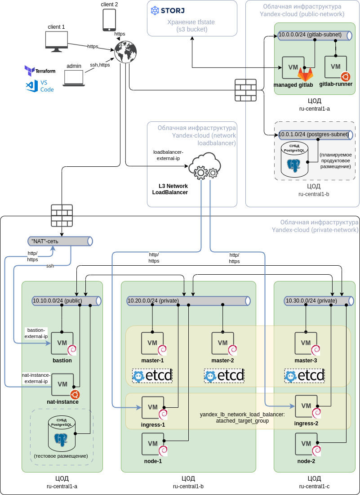

Это репозиторий для запуска автоматизированного развертывания инфраструктуры для финального проекта студента с номером s056635 курса Slurm DevOps Upgrade (5 поток).

Развертываются следующие инстансы:
 - bastion-хост;
 - nat-инстанс;
 - ноды кластера K8S на виртуальных машинах в указанном количестве.

Схема предлагаемого развертывания: 
 